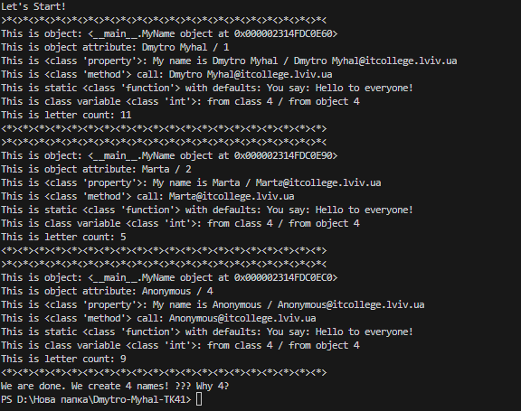

# Звіт до роботи
## Тема: _Основи ООП_
### Мета роботи: _Начитись використовувати основні принципи ООП, розглянути кострукції побудови класу та створення  обєтів та навчитись паювати з ними_

---
### Виконання роботи
* з Чат пробували написати програми які демонструють роботу класів [файл з виконаним завданням](3.ipynb);
- [Ще що до нього входить](my_class.py);
* виконали завдання по модифікації основного класу [файл з виконаним завданням](Secondclass.py);
- Результат роботи: ;
* тестові запитання [файл з виконаним завданням](test.ipynb);
## 

---
### Висновок:
> у висновку потрібно відповісти на запитання:

- :question: Що зроблено в роботі;
__У роботі засвоєно основи об’єктно-орієнтованого програмування, включно зі створенням класів та об’єктів, а також їх використанням для практичної реал.__
- :question: Чи досягнуто мети роботи;
__Так__
- :question: Які нові знання отримано;
__Отримано знання про основи об'єктно-орієнтованого програмування (ООП), зокрема про створення класів, атрибутів, методів та взаємодію з об'єктами через їх властивості та функції.__
- :question: Чи вдалось відповісти на всі питання задані в ході роботи;
__Я так думаю__
- :question: Чи вдалося виконати всі завдання;
__Так__
- :question: Чи виникли складності у виконанні завдання;
__Ні__
- :question: Чи подобається такий формат здачі роботи (Feedback);
__Так__
- :question: Побажання для покращення (Suggestions);
__Немає__

---